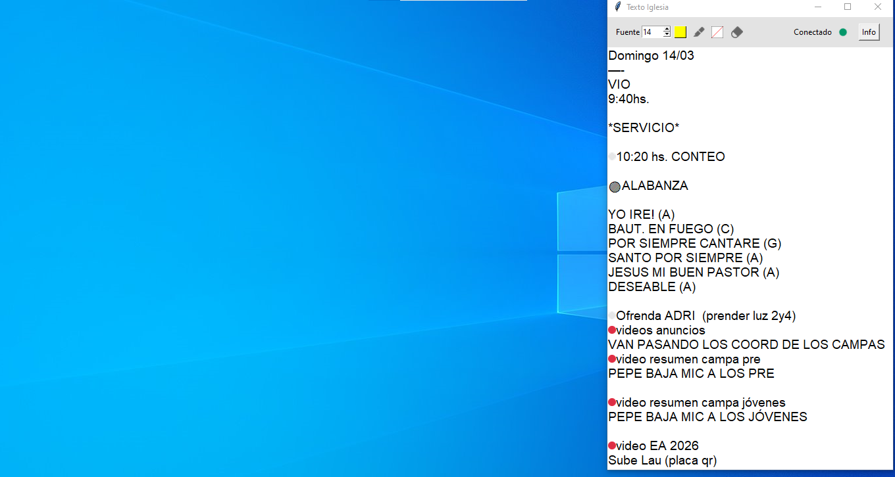
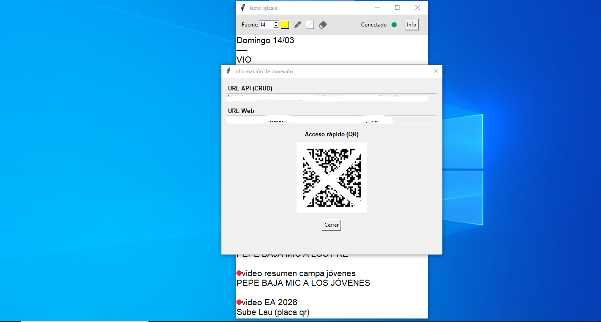
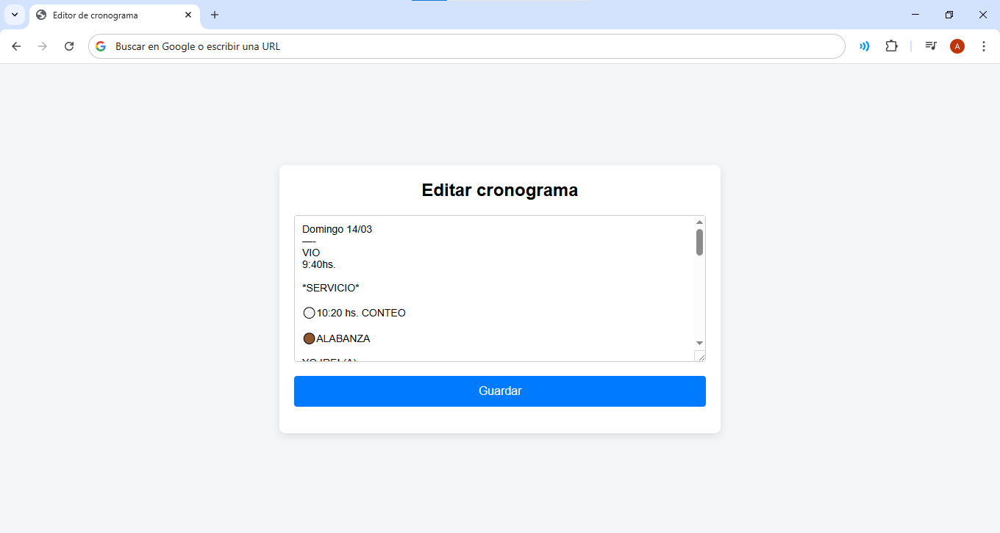

# 📝 Sistema de Gestión de Cronograma (Iglesia)

Aplicación desarrollada para la gestión y visualización en tiempo real de un cronograma compartido.

Incluye:

* Editor web
* API serverless en AWS
* Base de datos DynamoDB
* Cliente de escritorio en Python

---

## 🎯 Objetivo del proyecto

Este proyecto fue desarrollado como solución práctica para la gestión de información en tiempo real, aplicando conceptos de:

* Arquitectura serverless
* Comunicación cliente-servidor
* Sincronización de estado
* Testing manual con Insomnia
* Diseño funcional

---

## 🚀 Tecnologías utilizadas

* Python (Tkinter, Requests)
* AWS Lambda
* Amazon DynamoDB
* API Gateway
* HTML / JavaScript
* Pillow (manejo de imágenes)

---

## 🧩 Arquitectura


* Frontend web consume API REST
* Backend serverless procesa requests
* DynamoDB almacena el estado
* Cliente desktop sincroniza en tiempo real mediante long polling

---

## 🔄 Flujo de funcionamiento


## 🔄 Flujo de funcionamiento

El sistema utiliza un modelo de sincronización basado en versionado y consultas periódicas (long polling):

1. La aplicación de escritorio realiza una solicitud **GET** a la API incluyendo la versión actual del texto.
2. La API consulta la base de datos (DynamoDB) y compara la versión almacenada con la del cliente:

   * Si la versión es diferente, devuelve el nuevo contenido actualizado.
   * Si la versión es la misma, mantiene la conexión activa (long polling) hasta que haya cambios o se alcance un timeout.
3. Cuando el cliente recibe una nueva versión, actualiza automáticamente la interfaz.
4. En paralelo, el cliente web obtiene el contenido mediante una solicitud **GET** y lo muestra al usuario.
5. Cuando el usuario realiza una modificación desde la web, se envía una solicitud **PATCH** a la API con el nuevo contenido.
6. El backend procesa la actualización, guarda el nuevo texto en la base de datos e incrementa la versión.
7. Este cambio permite que los clientes en espera (long polling) detecten la nueva versión y sincronicen su contenido.

Este enfoque permite mantener múltiples clientes sincronizados en tiempo real sin necesidad de utilizar WebSockets.

---

## ✨ Funcionalidades

* Edición de texto en tiempo real
* Sincronización automática entre clientes
* Renderizado de emojis en aplicación desktop
* Sistema de versionado para evitar conflictos
* Indicador de estado de conexión
* Configuración persistente

---

## ⚙️ Configuración

El proyecto utiliza URLs configurables a través del json que genera automáticamente la aplicación:

```json
{
  "url_crud": "REEMPLAZAR_URL_API",
  "url_web": "REEMPLAZAR_URL_WEB"
}
```

---

## ⚠️ Consideraciones
Debido a que se utiliza en un entorno controlado:
* No incluye autenticación 
* CORS abiertos

---

## 📸 Capturas





---

## 👤 Autor

Agustín Cardozo - Estudiante de Ingeniería en Sistemas de Información
